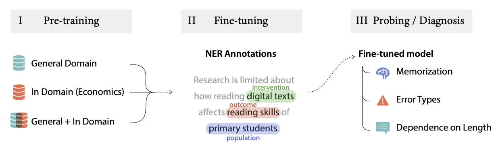
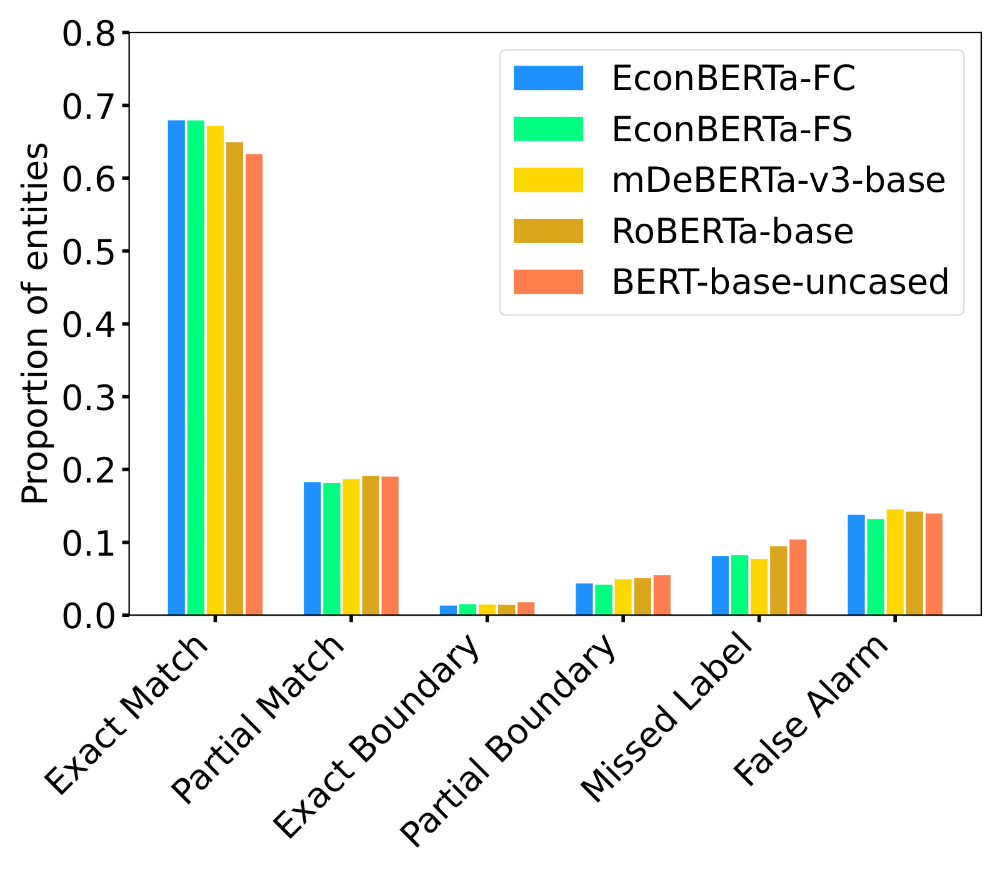
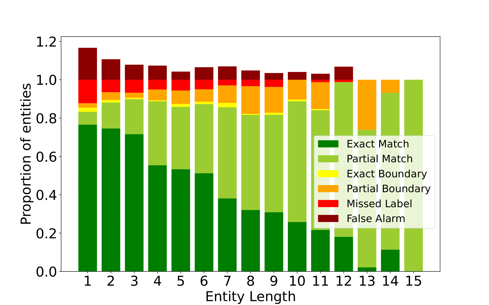
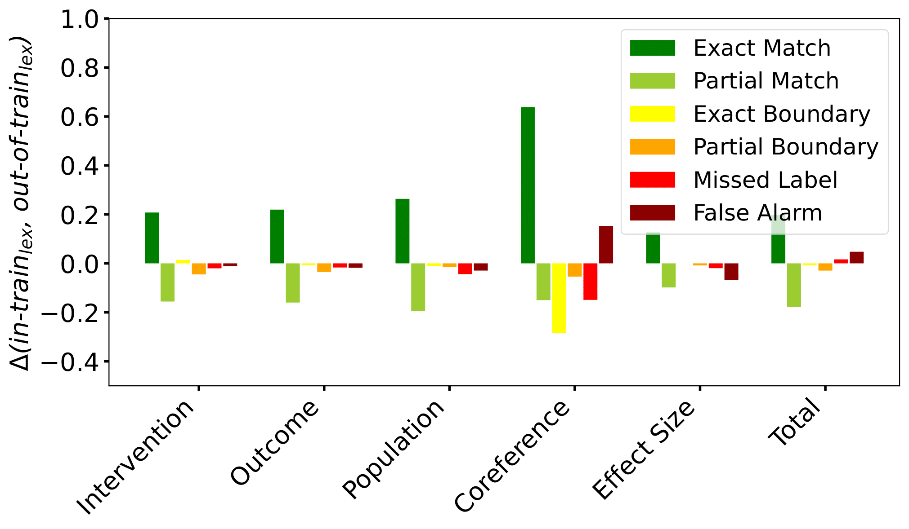
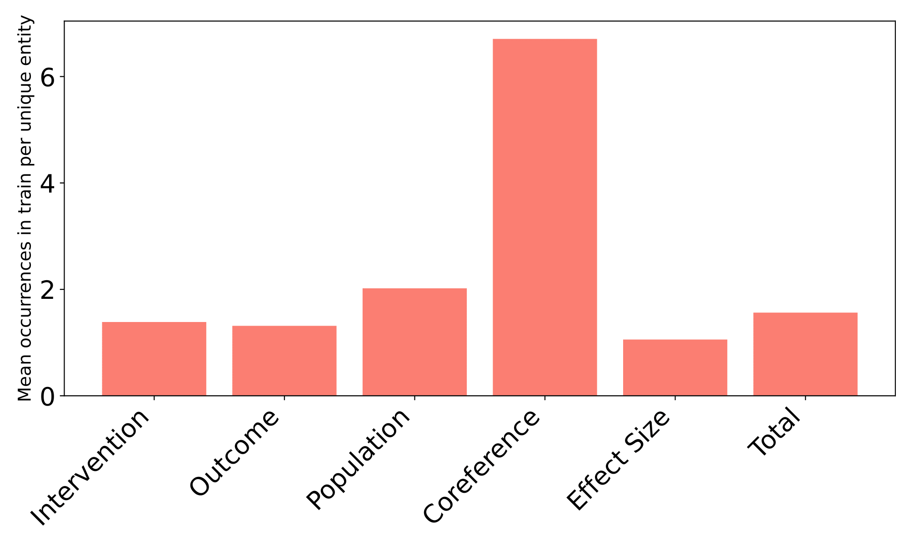
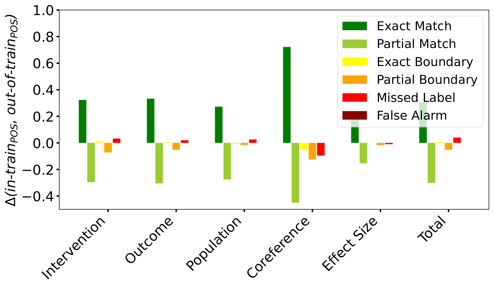
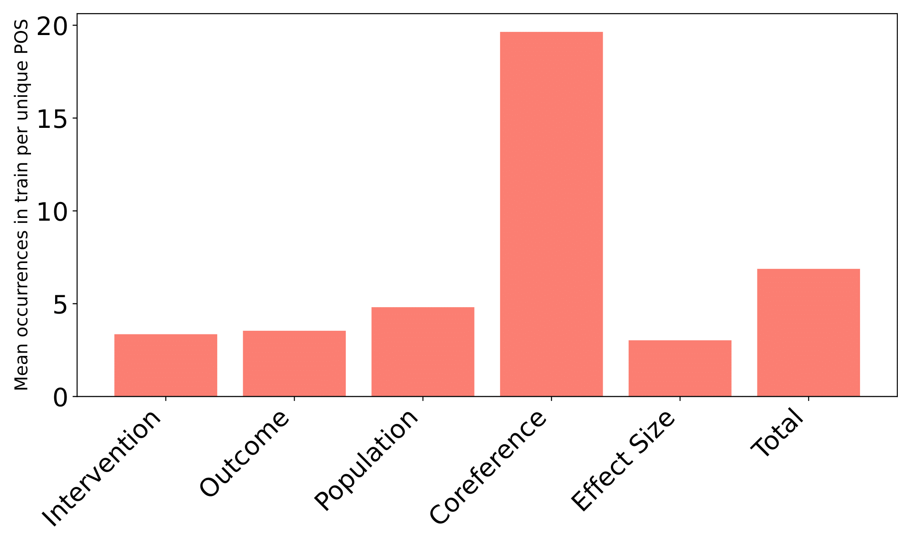

This repository contains the code for the paper [EconBERTa: Towards Robust Extraction of Named Entities in Economics](https://aclanthology.org/2023.findings-emnlp.774/) by Karim Lasri, Pedro Vitor Quinta de Castro, Mona Schirmer, Luis Eduardo San Martin, Linxi Wang, Tomáš Dulka, Haaya Naushan, John Pougué-Biyong, Arianna Legovini, and Samuel Fraiberger published at EMNLP Findings 2023.
<p align="center">
  
</p>

## Overview
We address the task of extracting entities from the economics literature on impact evaluation. To this end, we release `EconBERTa`https://github.com/worldbank/econberta-econie.git, a large language model pretrained on scientific publications in economics, and `ECON-IE`, a new expert-annotated dataset of economics abstracts for Named Entity Recognition (NER).
The repository contains
- model weights of `EconBERTa` (`mDeBERTa-v3` pre-trained - from scratch and further - on 1,5M economic research articles)
- model weights of `EconBERTa` finetuned on NER on the `ECON-IE` dataset
- `ECON-IE` final annotation after aggregation and curation phase
It also provides scripts to reproduce the results in the paper, notably for
- finetuning `EconBERTa` on `ECON-IE`: paper section 3.2 and 4, see folder `finetuning`
- evaluation generalization performance: paper section 4, see folder `analyses`


## Prerequisites
To set up an environment with the required packages, run
```
conda create -n econberta python=3.9.7
conda activate econberta
pip install allennlp==2.10.1 allennlp-models==2.10.1 allennlp-optuna==0.1.7
pip install -r requirements.txt
```

`AllenNLP` should be installed first because it has conflicting dependencies with later versions of `transformers`. 

## Domain-adpated EconBERTa model
EconBERTa is a DeBERTa-based language model adapted to the domain of economics. It has been pretrained following the [ELECTRA](https://arxiv.org/abs/2003.10555) approach, using a large corpus consisting of 9,4B tokens from 1,5M economics papers (around 800,000 full articles and 700,000 abstracts). 
We release EconBERTa on huffingface's transformers [here](https://huggingface.co/worldbank/econberta).
## NER dataset Econ-IE 
ECON-IE consists of 1,000 abstracts from economics research papers, totalling more than 7, 000 sentences. The abstracts summarize impact evaluation (IE) studies, aiming to measure the causal effects of interventions on outcomes by using suitable statistical methods for causal inference. The dataset is sampled from 10, 000 studies curated by [3ie](https://www.3ieimpact.org/), published between 1990 and 2022, and covering all 11 sectors defined by the [World Bank Sector Taxonomy](https://thedocs.worldbank.org/en/doc/538321490128452070-0290022017/New-Sector-Taxonomy-and-definitions).

## Finetune models
In order to perform finetune for each of the five models presented in the paper (our `EconBERTa` models "from scratch", and "from pretrained", along with baselines, `bert`, `roberta` and `mdeberta-v3`), simply run :
```
cd finetuning
```
```
sh run_finetuning.sh
```
This will save the finetuned model weights in a `models/` folder. 

## Plot error types
After models have been finetuned, simply run the following :
```
python analyses/plot_error_types.py --output_file <path_to_output>
```
By default, the plot containing error types will be saved at `plots/error_types.pdf`. 

<p align="center">
  
</p>

## Plot error types by length
You can further plot errors as a function of the length of target entities, in tokens, by running :
```
python analyses/plot_error_types.py --output_file <path_to_output>
```
By default, the plot containing error types by length ,  will be saved at `plots/err_types_by_length.pdf`.

<p align="center">
  
</p>

## Examine memorization patterns
You can further analyze memorization patterns for the EconBERTa model by running :
```
python analyses/analyze_memorization.py --output_folder <path_to_output_folder>
```
By default, the plot containing error types by length ,  will be saved at `plots/` and will contain four files corresponding to the four subplots in Fig. 5 of our article. On the one hand, `performance_gain_lexicon.pdf` and `performance_gain_POS.pdf` display performance gains on entities and POS sequences seen during training versus those absent of the training set. On the other hand, `mean_occ_lexicon.pdf` and `mean_occ_POS.pdf` display the mean number of occurrences for each unique entity and POS sequence seen during training. 

<p align="center">
  
</p>

<p align="center">
  
</p>

<p align="center">
  
</p>

<p align="center">
  
</p>


If you find this repository useful in your research, please cite the following paper:

```
@inproceedings{lasri2023econberta,
  title={EconBERTa: Towards Robust Extraction of Named Entities in Economics},
  author={Lasri, Karim and de Castro, Pedro Vitor Quinta and Schirmer, Mona and San Martin, Luis Eduardo and Wang, Linxi and Dulka, Tom{\'a}{\v{s}} and Naushan, Haaya and Pougu{\'e}-Biyong, John and Legovini, Arianna and Fraiberger, Samuel},
  booktitle={Findings of the Association for Computational Linguistics: EMNLP 2023},
  pages={11557--11577},
  year={2023}
}
```
